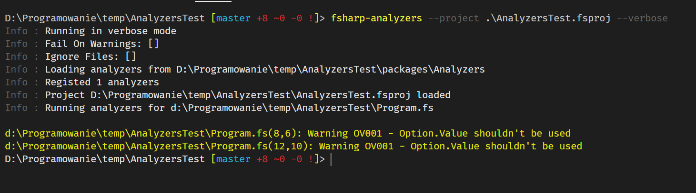
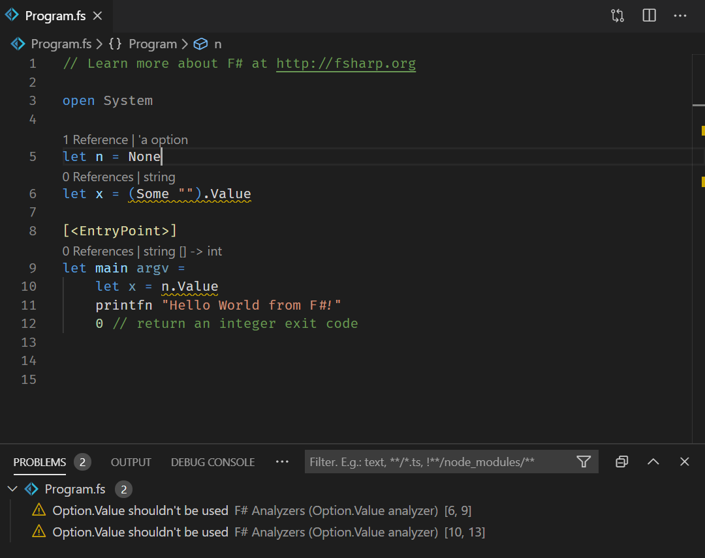

### Sample for using F# Analyzers in the project

This repo shows how to use F# Analyzer in your F# project. I'm using sample analyzer I've published - `FSharp.Analyzers.Sample` that is warning about any usage of `Option.Value` call

## How to run analyzer in this project

1. Restore packages with `paket restore`
2. Install `fsharp-analyzers` tool as global .Net tool - `dotnet tool install fsharp-analyzers -g`
3. Run tool with `--project` argument - `fsharp-analyzers --project .\AnalyzersTest.fsproj --verbose`

## How to use in editor

1. Requires Ionide 4.4.0
2. Open VSCode
3. Go to settings and set `FSharp.enableAnalyzers` to `true`
4. Reload window

## How to add F# Analyzer to your project

1. Using Paket add analyzer to the analyzers group (don't set `storage: none` - we want to install it locally)
2. Run `paket install`
3. Install `fsharp-analyzers` tool as global .Net tool - `dotnet tool install fsharp-analyzers -g`
4. Run tool with `--project` argument - `fsharp-analyzers --project PATH_TO_YOUR_FSPROJ --verbose`

## Learn more about F# Analyzers

* Blog post introducing F# Analyzers - https://medium.com/lambda-factory/introducing-f-analyzers-772487889429
* FSharp.Analyzers.SDK project (SDK for creating Analyzers, and `fsharp-analyzers` CLI tool) - https://github.com/ionide/FSharp.Analyzers.SDK
* FSharp.Analyzers.Sample (sample analyzer used in this repo) - https://github.com/Krzysztof-Cieslak/FSharp.Analyzers.Sample

## Contributing and copyright

The project is hosted on [GitHub](https://github.com/Krzysztof-Cieslak/AnalyzersShowcase) where you can [report issues](https://github.com/Krzysztof-Cieslak/AnalyzersShowcase/issues), fork
the project and submit pull requests.

The library is available under [MIT license](https://github.com/Krzysztof-Cieslak/AnalyzersShowcase/blob/master/LICENSE.md), which allows modification and redistribution for both commercial and non-commercial purposes.
